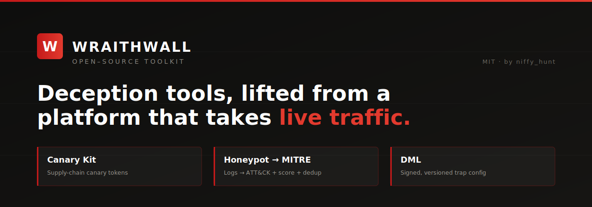
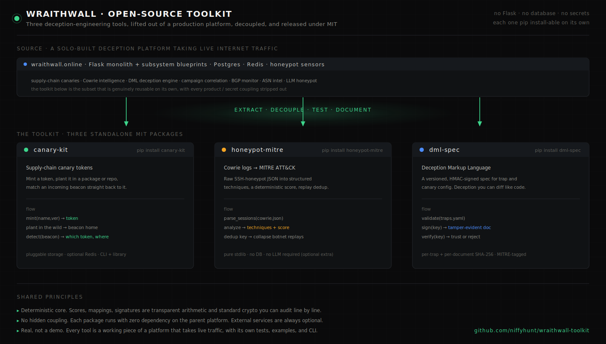

# WraithWall Open-Source Toolkit

Four deception-engineering tools, lifted out of a production security platform that takes
live internet traffic, cleaned of all product/secret coupling, and released under **MIT**.

This isn't a lab demo. Each tool is a piece of [WraithWall](https://wraithwall.online) — a
solo-built deception platform running behind a reverse proxy with a honeypot feeding it
around the clock. These are the parts that are genuinely reusable on their own: if you run
a honeypot, plant canaries, or want your deception config versioned like code, they're for
you.

Every project is a standalone, `pip install`-able package with its own README, examples,
tests, and CLI. **No dependency on the platform** — no Flask, no database, no secrets.



---

## The tools

| Project | What it does | Install |
|---|---|---|
| **[canary-kit](canary-kit/)** | Mint, register, and detect **supply-chain canary tokens** — match an incoming beacon straight back to the token you planted. Pluggable storage, optional Redis. | `cd canary-kit && pip install .` |
| **[honeypot-mitre](honeypot-mitre/)** | Turn raw **Cowrie honeypot logs** into structured **MITRE ATT&CK** techniques, a **deterministic score**, and **replay dedup** — no LLM required (it's an optional extra). | `cd honeypot-mitre && pip install .` |
| **[dml-spec](dml-spec/)** | **Deception Markup Language** — a versioned, **HMAC-signed** spec for trap/canary config. Validate, sign, and verify so your deception is diffable and tamper-evident. | `cd dml-spec && pip install .` |
| **[wraithmesh](wraithmesh/)** | **Distributed sensor mesh** — tail Cowrie logs, collapse campaigns locally, uplink signed **equivalence-class observations** to corroborating aggregators. Privacy-preserving egress by default. | `cd honeypot-mitre && pip install . && cd ../wraithmesh && pip install .` |

---

## Quick taste

```bash
# 1. Canary Kit — mint a token, then detect its beacon
cd canary-kit && pip install .
canary-kit --registry demo.json mint internal-sdk 2.4.1 --type runtime
# ...the token later beacons home from an environment you don't control:
canary-kit --registry demo.json beacon <token-from-mint> --ip 198.51.100.23

# 2. Honeypot → MITRE — raw cowrie log to scored, mapped sessions
cd ../honeypot-mitre && pip install .
honeypot-mitre examples/sample_cowrie.json     # → per-session techniques + score + dedup key

# 3. DML — validate, sign, and verify a deception document
cd ../dml-spec && pip install .
export DML_KEY="your-signing-key"
dml validate examples/example_traps.yaml
dml sign     examples/example_traps.yaml --key-env DML_KEY > signed.yaml
dml verify   signed.yaml --key-env DML_KEY

# 4. WraithMesh — Cowrie tail to signed campaign observations
cd ../wraithmesh && pip install .
export WRAITHMESH_KEY="demo-key"
wraithmesh init-manifest --output /tmp/mesh.json
wraithmesh sensor run --config /tmp/mesh.json --once --log ../honeypot-mitre/examples/sample_cowrie.json
```

See each project's README for the full API, CLI, and design notes.

---

## Design principles (shared across all four)

- **Deterministic core.** Scores, mappings, and signatures are transparent arithmetic and
  standard crypto you can run in your head or audit line-by-line — not a black box. Where an
  LLM helps, it's strictly optional.
- **No hidden coupling.** Each package imports and runs with zero dependency on the parent
  platform, Flask, a database, or Redis. External services (Redis, an LLM, persistence) are
  pluggable interfaces with sensible in-memory defaults.
- **No secrets, ever.** Signing keys and credentials come from the caller (constructor arg
  or an env var the caller sets). Nothing is hardcoded.
- **Honest about limits.** Substring-based ATT&CK matching is crude; correlation is
  near-real-time, not exhaustive. The docs say so plainly rather than implying coverage that
  isn't there.

## Requirements

- Python **3.10+**
- That's mostly it — dependencies are minimal and declared per-project in each
  `pyproject.toml`.

## License

All four projects are released under the [MIT License](LICENSE) — © 2026 niffy_hunt.
Use them, fork them, ship them. Attribution appreciated, not required.

---

*Part of the [WraithWall](https://wraithwall.online) project · by [Niffy_hunt](https://x.com/Niffy_hunt) · [@wraithwalll on X](https://x.com/wraithwalll?s=11) · [wraithwall on GitHub](https://github.com/niffyhunt/wraithwall)*

